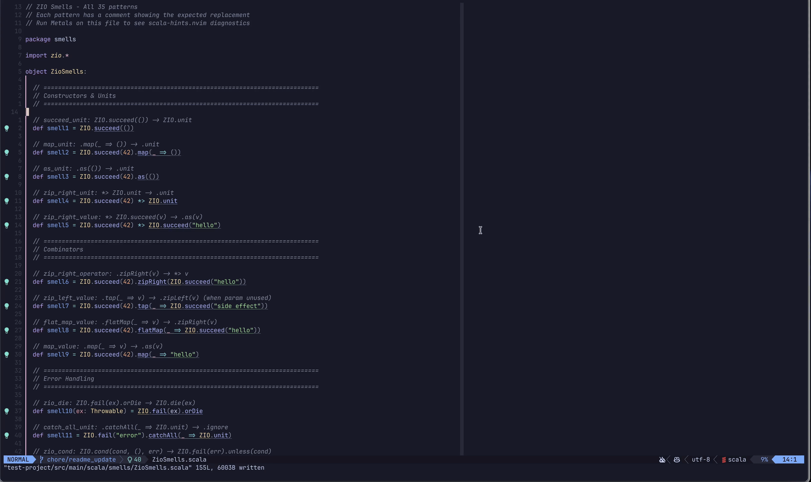

# scala-hints.nvim

Opinionated Neovim diagnostics + quickfix code actions for **ZIO**, **Cats-Effect (IO/Resource)**, **Cats tagless-final (F[_])**, and **Monix (Task/Observable)** Scala code.

## Demo



## Features

- **114 Treesitter patterns** detecting common effect code smells with idiomatic replacements
  - 35 ZIO patterns
  - 40 Cats-Effect patterns  
  - 15 Cats tagless-final patterns
  - 24 Monix patterns
- **Workspace diagnostics** — after Metals is ready, indexes every Scala source file for Trouble, quickfix, and native navigation
- **Native diagnostics & code actions** via `vim.diagnostic.set()` and LSP handler
- **Metals-aware** — type verification ensures replacements only apply to actual effect types
- **Evidence-gated** — tagless-final patterns verify typeclass bounds in enclosing `def` signatures
- **Configurable severity** — set each pattern as `HINT`, `INFO`, `WARN`, `ERROR`, or `OFF`

## Requirements

- Neovim 0.11+
- [nvim-metals](https://github.com/scalameta/nvim-metals)
- [plenary.nvim](https://github.com/nvim-lua/plenary.nvim)

## Installation

**lazy.nvim:**

```lua
{
  'olisikh/scala-hints.nvim',
  opts = {},
  dependencies = {
    'nvim-lua/plenary.nvim',
    'scalameta/nvim-metals',
  },
}
```

## Usage

1. Open any Scala file with Metals running
2. Once Metals finishes indexing, scala-hints scans every Scala source file in that workspace
3. Use Trouble, quickfix, or native diagnostic navigation to reach hints in files you have not opened
4. Apply fixes via `:lua vim.lsp.buf.code_action()` or your keymap

Workspace indexing is enabled by default. Disable it when a project is too large or you only want open-buffer diagnostics.

### Commands

| Command | Description |
| --- | --- |
| `:ScalaHintsApplyBuffer` | Apply all fixes in the current buffer |
| `:ScalaHintsWorkspaceRefresh` | Re-index all Scala files in attached Metals workspaces |
| `:ScalaHintsWorkspaceCancel` | Cancel active workspace indexing |

## Configuration

```lua
require('scala-hints').setup({
  workspace_diagnostics = {
    enabled = false, -- defaults to true
  },
  diagnostics = {
    default_severity = 'HINT',
    overrides = {
      ['zio/zip_left_value'] = 'OFF',
      ['zio/zio_die'] = 'WARN',
    },
  },
})
```

See [Configuration](https://github.com/olisikh/scala-hints.nvim/wiki/2.-Configuration) for all options.

## Documentation

Full documentation is available on the [Wiki](https://github.com/olisikh/scala-hints.nvim/wiki):

- [Installation](https://github.com/olisikh/scala-hints.nvim/wiki/1.-Installation) — setup instructions
- [Configuration](https://github.com/olisikh/scala-hints.nvim/wiki/2.-Configuration) — all options
- [Patterns](https://github.com/olisikh/scala-hints.nvim/wiki/3.-Patterns) — all 114 patterns with detection rules
- [ZIO](https://github.com/olisikh/scala-hints.nvim/wiki/4.-ZIO) — deep dive into ZIO patterns (35)
- [Cats-Effect](https://github.com/olisikh/scala-hints.nvim/wiki/5.-Cats-Effect) — IO/Resource patterns (40)
- [Cats Tagless-Final](https://github.com/olisikh/scala-hints.nvim/wiki/6.-Cats-Tagless-Final) — F[_] patterns (15)
- [Monix](https://github.com/olisikh/scala-hints.nvim/wiki) — Task/Observable patterns (24)

## Troubleshooting

- **No diagnostics?** Wait for Metals to initialize and complete the initial workspace scan
- **Diagnostics disappear after undo?** Reopen the buffer or save to refresh

## Contributing

See [AGENTS.md](AGENTS.md) for architecture details and the pattern addition guide.

## References

- [ZIO Documentation](https://zio.dev/)
- [Cats-Effect Documentation](https://typelevel.org/cats-effect/)
- [Monix Documentation](https://monix.io/)
- [IntelliJ ZIO Plugin](https://plugins.jetbrains.com/plugin/13820-zio-for-intellij/features)
- [nvim-metals](https://github.com/scalameta/nvim-metals)
